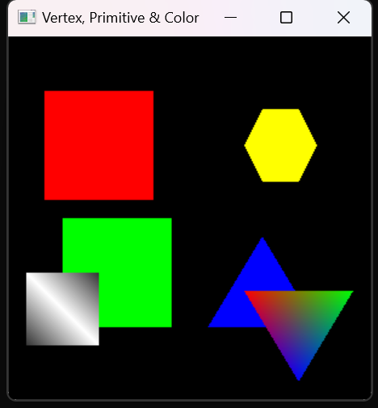
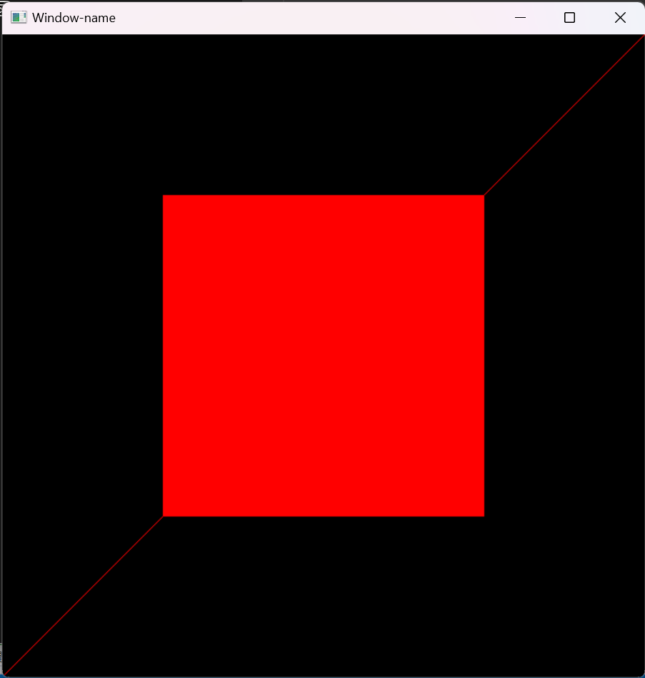
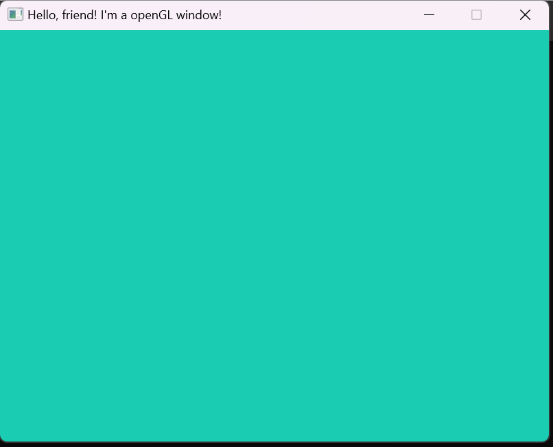

# ComputerGraphicLab1

## IDE

Visual Studio 2022
运行时候选择x86

## 导库  

glut -> #include<glut.h>  
glew -> #include<GL/glew.h>  
glfw -> #include<GLFW/glfw3.h>

## 一些测试用例
```
#include <windows.h>  // 用于MS Windows
#include <glut.h>  // GLUT，包括glu.h和gl.h

 /* 初始化OpenGL图形 */
void initGL() {
    // 设置“清除”或背景颜色
    glClearColor(0.0f, 0.0f, 0.0f, 1.0f); // 黑色和不透明
}

/* 窗口重绘事件的处理程序。在窗口首次出现时调用，以及窗口需要重新绘制时调用。 */
void display() {
    glClear(GL_COLOR_BUFFER_BIT);   // 使用当前清除颜色清除颜色缓冲区

    // 在一对glBegin和glEnd之间定义形状
    glBegin(GL_QUADS);              // 每组4个顶点形成一个四边形
    glColor3f(1.0f, 0.0f, 0.0f); // 红色
    glVertex2f(-0.8f, 0.1f);     // 以逆时针（CCW）顺序定义顶点
    glVertex2f(-0.2f, 0.1f);     // 这样正面（前面）对着你
    glVertex2f(-0.2f, 0.7f);
    glVertex2f(-0.8f, 0.7f);

    glColor3f(0.0f, 1.0f, 0.0f); // 绿色
    glVertex2f(-0.7f, -0.6f);
    glVertex2f(-0.1f, -0.6f);
    glVertex2f(-0.1f, 0.0f);
    glVertex2f(-0.7f, 0.0f);

    glColor3f(0.2f, 0.2f, 0.2f); // 深灰色
    glVertex2f(-0.9f, -0.7f);
    glColor3f(1.0f, 1.0f, 1.0f); // 白色
    glVertex2f(-0.5f, -0.7f);
    glColor3f(0.2f, 0.2f, 0.2f); // 深灰色
    glVertex2f(-0.5f, -0.3f);
    glColor3f(1.0f, 1.0f, 1.0f); // 白色
    glVertex2f(-0.9f, -0.3f);
    glEnd();

    glBegin(GL_TRIANGLES);          // 每组3个顶点形成一个三角形
    glColor3f(0.0f, 0.0f, 1.0f); // 蓝色
    glVertex2f(0.1f, -0.6f);
    glVertex2f(0.7f, -0.6f);
    glVertex2f(0.4f, -0.1f);

    glColor3f(1.0f, 0.0f, 0.0f); // 红色
    glVertex2f(0.3f, -0.4f);
    glColor3f(0.0f, 1.0f, 0.0f); // 绿色
    glVertex2f(0.9f, -0.4f);
    glColor3f(0.0f, 0.0f, 1.0f); // 蓝色
    glVertex2f(0.6f, -0.9f);
    glEnd();

    glBegin(GL_POLYGON);            // 这些顶点形成一个闭合多边形
    glColor3f(1.0f, 1.0f, 0.0f); // 黄色
    glVertex2f(0.4f, 0.2f);
    glVertex2f(0.6f, 0.2f);
    glVertex2f(0.7f, 0.4f);
    glVertex2f(0.6f, 0.6f);
    glVertex2f(0.4f, 0.6f);
    glVertex2f(0.3f, 0.4f);
    glEnd();

    glFlush();  // 立即渲染
}

/* 主函数：GLUT作为一个控制台应用程序从main()开始运行 */
int main(int argc, char** argv) {
    glutInit(&argc, argv);          // 初始化GLUT
    glutCreateWindow("Vertex, Primitive & Color");  // 创建带有给定标题的窗口
    glutInitWindowSize(320, 320);   // 设置窗口的初始宽度和高度
    glutInitWindowPosition(50, 50); // 将窗口的初始左上角位置定位
    glutDisplayFunc(display);       // 注册窗口重绘事件的回调处理程序
    initGL();                       // 我们自己的OpenGL初始化
    glutMainLoop();                 // 进入事件处理循环
    return 0;
}

```
 


```
#include <stdlib.h>
#define GLUT_DISABLE_ATEXIT_HACK
#include <glut.h>

void display(void)
{
	/* 清除所有的像素*/
	glClear(GL_COLOR_BUFFER_BIT);
	/* 绘制一个对角顶点坐标分别为(0.25, 0.25, 0.0) 和(0.75, 0.75, 0.0) 的白色多边形
	*（矩形） */
	glColor3f(1.0, 0.0, 0.0);
	glBegin(GL_POLYGON);//glBegin支持的方式除了GL_POINTS和GL_LINES，还有GL_LINE_STRIP，GL_LINE_LOOP，GL_TRIANGLES，GL_TRIANGLE_STRIP，GL_TRIANGLE_FAN
	//适当了解一些，当然，确认顶点的方式也有很多种：glVertex2d glVertex2f glVertex3f glVertex3fv等等~~~~
	glVertex3f(0.25, 0.25, 0.0);
	glVertex3f(0.75, 0.25, 0.0);
	glVertex3f(0.75, 0.75, 0.0);
	glVertex3f(0.25, 0.75, 0.0);
	glEnd();
	glBegin(GL_LINES);
	glVertex2d(0.0, 0.0);
	glVertex2d(5.0, 5.0);
	glEnd();

	/* 不等待！立刻开始处理在缓冲区中的OpenGL函数调用*/
	glFlush();//保证前面的OpenGL命令立即执行（而不是让它们在缓冲区中等待）。其作用跟fflush(stdout)类似。
}

void init(void)
{
	/* 指定清除颜色*/
	glClearColor(0.0, 0.0, 0.0, 0.0);
	/* 初始化视景体*/
	glMatrixMode(GL_PROJECTION);
	glLoadIdentity();
	glOrtho(0.0, 1.0, 0.0, 1.0, -1.0, 1.0);
}

/* 指定窗口的初始大小和位置以及显示模式（单缓存和RGBA模式）
* 打开一个标题为“hello”的窗口，调用初始化函数
* 注册用于显示图形的回调函数，进入主循环并处理事件
*/
int main(int argc, char** argv)
{
	glutInit(&argc, argv); /*初始化GLUT并处理命令行参数*/

	//设置显示方式，前面是缓冲的选择，有GLUT_SINGLE-使用单缓冲区  GLUT_DOUBLE-双缓冲区
	//后面的是颜色表示的方式：GLUT_RGB使用RGB颜色 GLUT_INDEX使用索引颜色
	glutInitDisplayMode(GLUT_SINGLE | GLUT_RGB);

	glutInitWindowSize(600, 600); /*指定窗口的大小，单位为像素*/
	glutInitWindowPosition(200, 200); /*指定窗口左上角在屏幕上的位置*/

	glutCreateWindow("Window-name"); /*使用一个OpenGL场景创建一个窗口*/
	//注意的是：窗口创建之后，并不能立即显示在屏幕上，需要调用glutMainLoop()才能
	init();
	glutDisplayFunc(display);//暂时理解成：设置一个函数，当需要进行画图时，这个函数就会被调用
	glutMainLoop();//进行消息循环（暂时这么理解吧）

	return 0; /* ANSI C 要求main()返回一个int值*/
}

```
 
```
#include <iostream>		
using namespace std;
#define GLEW_STATIC     
#include <GL/glew.h>    
#include <GLFW/glfw3.h> 
const GLint WIDTH = 800, HEIGHT = 600;		// 先设置窗口以及其大小								
int main()
{	
	glfwInit();								//初始化，使用glfw来打开一个窗口
	glfwWindowHint(GLFW_CONTEXT_VERSION_MAJOR, 3);			
	glfwWindowHint(GLFW_CONTEXT_VERSION_MINOR, 3);															
	glfwWindowHint(GLFW_OPENGL_PROFILE, GLFW_OPENGL_CORE_PROFILE);	
	glfwWindowHint(GLFW_OPENGL_FORWARD_COMPAT, GL_TRUE);	
	glfwWindowHint(GLFW_RESIZABLE, GL_FALSE);						// 缩放窗口的关闭
	GLFWwindow* window_1 = glfwCreateWindow(WIDTH, HEIGHT, "Hello, friend! I'm a openGL window!", nullptr, nullptr);  
	int screenWidth, screenHeight;
	glfwGetFramebufferSize(window_1, &screenWidth, &screenHeight);  // 获得实际占用的帧缓存大小
	if (nullptr == window_1)			//判断窗口输出是否成功
	{
		cout << "Failed to create GLFW window" << endl;
		glfwTerminate();    
		return -1;          
	}
	glfwMakeContextCurrent(window_1);   // 捕获当前窗口，准备对当前窗口进行画图
	glewExperimental = GL_TRUE;			
	if (glewInit() != GLEW_OK)			// 判断glew初始化是否成功
	{
		cout << "Failed to initialise GLEW" << endl;
		glfwTerminate();			
		return -1;
	}
	glViewport(0, 0, screenWidth, screenHeight);	// 设置视口的大小
	while (!glfwWindowShouldClose(window_1))		
	{
		glfwPollEvents();						
		glClearColor(0.1f, 0.8f, 0.7f, 1.0f);		// 分别是红、绿、蓝、透明度的四个参数。RGB三原色+透明度
		glClear(GL_COLOR_BUFFER_BIT);			
		glfwSwapBuffers(window_1);					// 双缓存模式
	}
	glfwTerminate();								// 如果循环结束：glfw关闭
	return 0;
}


```
 
